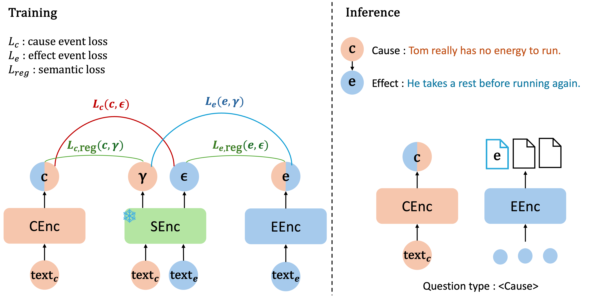

# causality-aware-retriever


<p align="center">
      
</p>

## Getting Started

### 1. Clone the repository

```bash
git clone https://github.com/00HS/causality-aware-retrieval.git
cd causality-aware-retrieval
```

### 2. Train the model
To train a model, select the appropriate command in `run_train.sh` by uncommenting it based on your desired model and task.
```bash 
bash run_train.sh
```

### 3. Evaluate the model

```bash 
bash run_eval.sh
```
